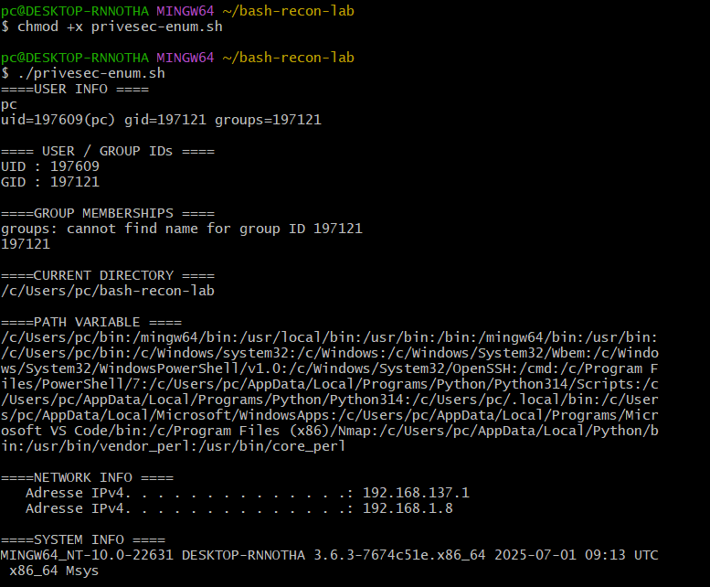

# Bash Recon Lab

## Objective

This project contains basic Bash scripting exercises focused on cybersecurity and reconnaissance automation.

The goal of this lab is to practice:
- Bash scripting
- Linux automation
- Network reconnaissance
- Enumeration concepts
- Cross-platform scripting with Git Bash

---

# Scripts

## recon.sh

Basic reconnaissance script displaying:
- current user
- current directory
- hostname
- network information

## network-info.sh

Advanced reconnaissance script displaying:
- hostname
- active network connections
- listening ports
- IP configuration
- routing information

---

# Commands Practiced

```bash
chmod +x
./script.sh
whoami
hostname
netstat -ano
ipconfig
```

---

# Skills Learned

- Bash scripting fundamentals
- Script execution
- Linux vs Windows command differences
- Network enumeration basics
- Understanding listening ports
- Basic automation concepts
- Git Bash usage

---

# Network Analysis

## Observations

### Listening Ports Detected

| Port | Service |
|---|---|
| 135 | RPC |
| 445 | SMB |
| 139 | NetBIOS |

### Active Connections

Multiple HTTPS established connections were observed on port 443.

### Network Configuration

- Local IP detected
- Gateway identified
- Multiple network interfaces observed
- OpenVPN interfaces detected

---

# Key Learning Outcomes

This lab helped improve:
- Bash scripting logic
- Reconnaissance methodology
- Understanding of network services
- Enumeration mindset
- Technical documentation skills

- ## Additional Bash Concepts

### Variables
Learned how to store and display data.

### User Input
Learned how to receive user input using read.

### Conditions
Practiced if/else logic.

### Loops
Practiced automation using for loops.

### Ping Automation
Created a simple ping reconnaissance script.

# Day 5 - Nmap Enumeration and Scanning

## Objective

Practice advanced reconnaissance and enumeration techniques using Nmap and Bash scripting.

---

# Nmap Concepts Practiced

## TCP Scan

Used to identify open TCP ports and services.

### Example

```bash
sudo nmap 127.0.0.1
```

---

## SYN Scan

Half-open scan commonly used during penetration testing.

### Example

```bash
sudo nmap -sS 127.0.0.1
```

### Why Important

- Faster scanning
- More discreet
- Commonly used by pentesters

---

## UDP Scan

Used to identify UDP services.

### Example

```bash
sudo nmap -sU 127.0.0.1
```

### Why Important

UDP services are often forgotten but may expose vulnerable services.

---

## Version Detection

Used to identify service versions.

### Example

```bash
sudo nmap -sV 127.0.0.1
```

### Why Important

Service versions may contain known vulnerabilities.

---

## OS Detection

Attempts to identify the operating system.

### Example

```bash
sudo nmap -O 127.0.0.1
```

---

## Aggressive Scan

Combines:
- version detection
- OS detection
- NSE scripts
- traceroute

### Example

```bash
sudo nmap -A 127.0.0.1
```

---

# Enumeration Methodology

1. Identify target
2. Scan ports
3. Identify services
4. Detect versions
5. Analyze attack surface

---

# Bash Script Added

## nmap-scan.sh

Simple Bash script automating an Nmap SYN scan.

### Script Features

- User input
- Automated scanning
- Basic reconnaissance automation

---

# Skills Learned

- Nmap usage
- TCP vs UDP scanning
- SYN scan methodology
- Enumeration concepts
- Bash automation
- Reconnaissance workflow

  # Day 7 - Service Enumeration

## Objective

Practice service enumeration techniques used during penetration testing.

The goal is to identify:
- services
- versions
- shares
- exposed resources
- potential attack surfaces

---

# Services Studied

## FTP - Port 21

Used for file transfer.

### Pentester Goals

- Check anonymous access
- Identify exposed files
- Detect upload permissions
- Identify FTP server version

---

## SSH - Port 22

Used for secure remote Linux access.

### Pentester Goals

- Identify SSH version
- Detect authentication methods
- Search for known vulnerabilities

---

## SMB - Port 445

Used for Windows file sharing and Active Directory environments.

### Pentester Goals

- Enumerate SMB shares
- Identify domains/workgroups
- Detect anonymous access
- Analyze permissions

---

## HTTP/HTTPS - Ports 80/443

Used for web applications and websites.

### Pentester Goals

- Detect technologies
- Enumerate directories
- Analyze HTTP headers
- Identify admin panels

---

# Enumeration Concepts

## Scan vs Enumeration

### Scan
Identifies open ports.

### Enumeration
Collects detailed information about exposed services.

---

# Tools Used

- Nmap
- smbclient
- curl
- Gobuster

---

# Commands Practiced

```bash
nmap -sV
nmap --script smb-os-discovery
smbclient -L
curl -I
```

---

# Script Added

## service-enum.sh

Simple Bash script automating:
- service version detection
- HTTP header analysis

---

# Key Learning Outcomes

- Understanding common network services
- Difference between scanning and enumeration
- Importance of service versions
- SMB and FTP enumeration basics
- Pentest reconnaissance methodology

# Screenshots

## Service Enumeration Output


# Day 8 - Linux Privilege Escalation Basics

## Objective

Practice Linux local enumeration and privilege escalation concepts used during penetration testing.

---

# Concepts Practiced

- Local enumeration
- User and group identification
- sudo privilege analysis
- SUID files
- PATH variable inspection
- Linux permissions
- System information gathering

---

# Commands Practiced

```bash
whoami
id
groups
pwd
echo $PATH
uname -a
sudo -l
find / -perm -4000
```

---

# Script Added

## privesc-enum.sh

Simple Bash script automating:
- user enumeration
- group enumeration
- PATH inspection
- network information
- system information gathering

---

# Key Learning Outcomes

- Understanding Linux privilege escalation basics
- Identifying users and groups
- Understanding PATH variables
- Recognizing dangerous permissions
- Practicing local enumeration methodology
- # Screenshots

## Privilege Escalation Enumeration



# Day 9 - File Transfers & Networking Basics

## Objective

Practice file transfer techniques and networking concepts commonly used during penetration testing.

---

# Concepts Practiced

- File transfers
- Python HTTP server
- wget
- curl
- Netcat basics
- Reverse shell concepts
- Bind shell concepts

---

# Commands Practiced

```bash
wget
curl -O
python -m http.server
nc -lvnp
```

---

# Tools Used

- Python HTTP Server
- Netcat
- wget
- curl
- Git Bash

---

# Script Added

## transfer-helper.sh

Simple Bash script automating:
- local network information
- Python HTTP server startup

---

# Key Learning Outcomes

- Understanding file transfer methods
- Understanding basic shell concepts
- Learning networking communication basics
- Practicing local HTTP file sharing
- Understanding reverse shell vs bind shell concepts


